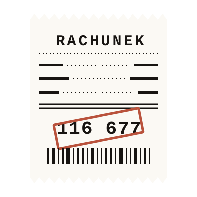

<p align="center"></p>

<h1 align="center">RACHUNEK ZA TOKENY</h1>

<p align="center"><b>A pitch deck shaped like an endless thermal receipt.</b><br>
<sub>9 770 sessions, 933 529 API calls, 116 677 USD. Line by line.</sub></p>

This is a static page that hands the audience a bill. It presents six findings from an analysis of the SWE-chat enhanced 2026-07-05 dataset: 9 770 agent coding sessions, 17,8 GB of raw transcripts, priced call by call against the official Anthropic and OpenAI rate cards. The hero asks `Kartą czy gotówką?` ("Card or cash?") and the page answers it over eight slides. Live at [quesma.agentshub.pl](https://quesma.agentshub.pl).

The receipt form is not decoration. The headline finding is that the bill is made of context, not output: cache reads alone are 64% of it. So every thesis is a priced line item, a sticky `SUMA DOTĄD` ticker grows under the audience as they scroll, and the finale slams a vermilion `NIEZAPŁACONE` stamp onto the total. The slides read like a receipt because the cost behaves like one.

Two variants ship side by side. Variant A (`index.html`) is the full look, with procedural 1-bit halftone canvas scenes stamped into every slide. Variant B (`paragon.html`) is the same copy and the same numbers rendered as a pure mono thermal receipt, no halftone, block-character bars. An `A / B` switch in the header moves between them. All copy is Polish, all of it lives in one file.

| # | Line item | Amount | Headline |
|---|---|---|---|
| 01 | `LINIE W COMMICIE` | 32 993 USD | "Połowa wygenerowanego kodu nie dożywa commita." Half the generated code never reaches a commit. |
| 02 | `NIEPRZECZYTANE` | `CZYNSZ ZA KONTEKST` | "Płacicie za odpowiedzi, których nikt nie czyta." 21% of final-reply tokens go to nobody, and stay in context. |
| 03 | `SUBAGENCI` | 2 164 USD | "Sesja z subagentami kosztuje trzy razy więcej." Median vibe session: 4,44 USD with Task, 1,45 USD without. |
| 04 | `KOMPAKCJA` | 36 593 USD | "Po kompakcji model czyta te same pliki od nowa." 59% of post-compaction reads are files already read. |
| 05 | `POLLING` | 1 360 USD | "Agent pyta w kółko, czy proces już się skończył." 10 316 status checks across 1 127 sessions. |
| 06 | `GORĄCE PLIKI` | `PODWÓJNA ROBOTA` | "Jeden plik, 120 sesji, edycje nakładają się w czasie." 2 908 session pairs editing the same file at once. |

The closing slide prints five lines from the analysis summary (cache reads 74 600 USD, tool results in context 30 746 USD, cache writes 26 000 USD, pushback 16 548 USD, coffee break 9 223 USD), then `DO ZAPŁATY 116 677 USD`, the stamp, and a halftone barcode.

## Documentation

| File | What it is |
|---|---|
| [`site/README.md`](site/README.md) | How to edit the page. Polish, written for whoever changes the copy. |
| [`site/CONTRACT.md`](site/CONTRACT.md) | The build contract: globals, data shapes, DOM and class names, slide mode, pitch cut. |
| [`DEPLOY.md`](DEPLOY.md) | Server setup, runner registration, Caddy block, first manual start. |
| [`SIX_THESES.md`](SIX_THESES.md) | Source research for the six line items. Polish, tables and definitions. |
| [`FINDINGS.md`](FINDINGS.md) | Full analysis the deck is cut from. Polish, method, ledger, all the numbers. |

## Architecture in one paragraph

There is no build step and no module system. Nine plain `<script defer>` tags load in a fixed order and each one exposes exactly one global: `RECEIPT_DATA` (all copy, all numbers), `Charts`, `Halftone`, `Scenes`, `Render`, `Motion`. Nothing runs at load time except `main.js`, which waits for `DOMContentLoaded` and then `document.fonts.ready`, builds the whole DOM from the data object, registers every `canvas[data-scene]` with the halftone engine, wires GSAP, and refreshes ScrollTrigger. Every boot step is wrapped, so a broken module logs and the page still renders. Scrolling behaves like a deck: CSS `scroll-snap-type: y mandatory` snaps one section per screen, each slide plays a print-reveal timeline once when it enters (a clip-path wipe with a printhead line chasing the edge), ArrowDown / ArrowUp / PageDown / PageUp / Space / Home / End jump between slides, and the header shows a slide counter next to the running total. Below 900px wide or 620px tall the deck turns itself off and becomes a normal scrolling page.

## Stack

Static HTML, CSS and vanilla JS. GSAP 3.12.5 plus ScrollTrigger from cdnjs, Schibsted Grotesk and Fragment Mono from Google Fonts. Quesma design system: lab paper palette, ink `#171411`, vermilion `#b9523c`, every colour literal confined to `tokens.css`.

```
site/
  index.html            variant A: halftone scenes in every slide
  paragon.html          variant B: pure mono thermal receipt, same data
  css/tokens.css        the only place a colour literal may appear
  css/receipt.css       strip, torn edges, header, ticker, slide layout
  css/charts.css        bars, stacked bars, waffle, histogram, tables
  css/paper.css         variant B overrides, loaded last
  js/data.js            ALL copy and ALL numbers, one global, nothing runs
  js/charts.js          six chart renderers, DOM only, no library
  js/halftone/engine.js canvas 2D, low-res buffer, Bayer 8x8 ordered dither
  js/halftone/scenes.js sun, sharks, skulls, fish, vortex, beach, surfers, barcode
  js/render.js          builds the whole DOM from RECEIPT_DATA
  js/motion.js          GSAP timelines, snap triggers, keyboard nav, ticker
  js/main.js            boot, each step wrapped so one failure is not fatal
deploy/
  nginx.conf            static server, gzip, healthz, cache headers
  Caddyfile.snippet     the block to paste into the shared Caddyfile
```

The halftone engine is the one piece worth naming. Each scene paints grayscale into a hidden low-resolution buffer, an 8x8 Bayer matrix turns it into ink or transparent pixels, and the result is blitted up with smoothing off. Paper is transparent, so the receipt grain shows through the dots. Scroll progress drives a print wipe across the buffer, and `prefers-reduced-motion` collapses the whole thing to one static frame.

## Running it

```bash
# open the deck straight from disk, no server, no install
open site/index.html      # variant A
open site/paragon.html    # variant B

# or serve it the way production does, nginx on port 8095
docker compose up
```

Nothing needs to run for the page to work. All paths are relative, GSAP and the fonts come from a CDN, and `docker compose up` only exists so the local container matches the production one.

Deployment goes through the repo: every push to `main` runs [`.github/workflows/deploy.yml`](.github/workflows/deploy.yml) on a self-hosted Hetzner runner, which resets the checkout to `origin/main`, rebuilds the nginx container behind the shared Caddy, and health-checks `quesma.agentshub.pl/healthz` for 60 seconds before calling it done.

## What is built and what is not

**There are no automated tests.** None. The deploy workflow carries a comment where a JS syntax smoke check belongs, but no such step is wired in. The only gate between a push and production is the post-deploy health check, and that only proves nginx is serving something.

**Visual QA was done by eye, in a browser.** Every slide was checked at 1280x800, 1440x900 and 1366x768 until it fit without an inner scrollbar. There are no screenshot tests and no layout assertions, so a copy change long enough to add a line can push a slide over the fold and nothing will catch it.

**Mobile is a fallback, not a design.** Below 900px wide or 620px tall the page drops slide snapping, the two-column slide grid and the per-slide timelines, and becomes a plain single-column scrolling receipt with one-shot reveals. It is readable. It is not the deck.

**The halftone scenes are procedural sketches, not illustrations.** Eight canvas routines built from paths, gradients and capped loops, dithered to 1-bit. They read as sharks, skulls and surfers at a glance and at stamp size, which is all they are asked to do. Nobody drew them.

**Two line items carry no amount on purpose.** `02 NIEPRZECZYTANE` and `06 GORĄCE PLIKI` show `CZYNSZ ZA KONTEKST` and `PODWÓJNA ROBOTA` instead of USD, because the analysis can locate where those tokens go but cannot price them cleanly. The rule for the whole deck is that no amount under 1 000 USD is ever shown, since it reads as noise next to 116 677 USD.

**The amounts are sums from the analysis tables, not a fresh computation.** Each line item adds up rows from `SIX_THESES.md` and `FINDINGS.md`. Two consequences worth stating plainly: the six line items total 73 110 USD, so the sticky ticker never reaches the headline figure, and the five closing lines are overlapping slices of the same 116 677 USD bill, not addends. The deck does not pretend otherwise, but it does not explain it on screen either.

**The CDN is a hard runtime dependency.** If cdnjs is unreachable, GSAP is missing, `Motion.init()` throws, and the boot wrapper catches it. The page still renders every slide, fully printed and static, with no snapping and no count-ups. That degraded state is designed for, not verified on a real outage.
